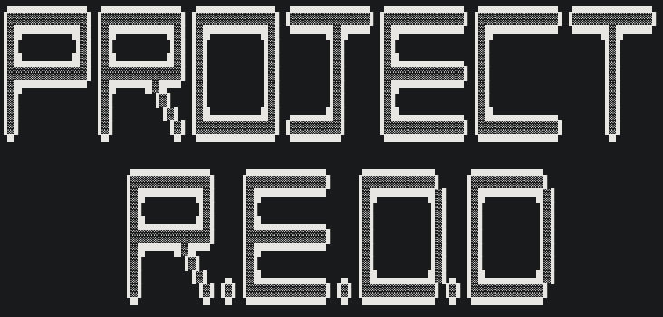

    

## Chapter 1.

In a single small room, at the bottom of a flight of soulless metal stairs is a girl. She’s pacing.  You can see the path she’s worn into the floor. In this room there is a wardrobe, filled with three of the same outfit, a bed, and a sink.

The outside of the room has the number 623 on it, painted in large gray letters. The rest of the room’s exterior is gray as well. A charming color palette. A single wire extends from an upper corner to loop down and then thread along the handrail of the metal bridge that spans the deep chasm between the room and stairs. It weaves around the metal, covered in dirt and dust and rust, and winds its way up to a tangled web of other wires stuck into a box. E7 is painted on its side. 

From the top of the box juts a pole with a light at its top. A single naked bulb casts rays of dying yellow light against the inky blackness of the pit, just enough so an observer might make out the pale gray sides and numbers of hundreds of rooms like 623. 

What happens behind each door is its own mystery. I only know of 623. 

The girl stops mid pace and checks her watch. She checks it incessantly. She hates the watch. It reads 8:53. Nearly time. She stops pacing, foot still in the air, when she hears a sound. 

It stands to reason that all of the rooms in all of this abyss were built at the same time. Reasonably by the same people. Likely for the same purpose. It was always strange to the girl in the room then, that the door to her neighboring pod, 625, would creak so horribly when opened. As far as she knew it was the only one that did. She’d checked many other doors at many other times, and all swung smoothly on thick iron hinges. All but 625. It rebelled. 

Through her own, more subservient, door came the muffled half sound of voices. Red didn’t need to hear them to know what was being said, so often had she herself been the recipient. It was a performance of sorts. One orator to two audience members. The same script, sometimes accompanied by a minor change. Red closed her eyes, imagining the scene. 

"Oh dear, oh precious.“ He’d say. “Now look what you’ve done.” The man would be standing in the doorway. Thick enough to obscure all but the slimmest view of the dark behind him. He would turn then, as if struck by a thought, and motion to the guard he’d brought with him, indicating for the body at his feet to receive another prod. There was, after all, no point in giving his speech to an unconscious audience. 

“They wanted to void you, you know.” He’d say, all sad and sincere. Then she’d play her part, with a groan or wheeze, some other suitably pitiful acknowledgement of consciousness. He’d stoop down to a crouch, bringing with him the unpleasant assortment of smells unsuccessfully masked by the mint he always seemed to be chewing. 

“But I stopped them. I did. Bleeding heart that I am.” He’d look back at the guard and wink. “Too soft, my mother always said.” 

Then he would pat her cheek and push himself back to his feet. 

“But I said wait.” He’d wag a finger. “She knows what she did.” A pause. Another wag, more emphatic. “She can do better.” 

“You can do better? Can’t you love?” No pause there. It wasn’t a question.

“You see, to these people, you’re a coin. And this here-” He’d gesture broadly at the mammoth structure of the dark lab behind him. “This here is a mint. An enterprising hive of industry, priming you. Yes you. For circulation. And no one wants a tarnished coin dear.”

Then came the inevitable freestyle. Sometimes that meant a history lesson. Of all the brave souls that had come before and their grand place in history and role in the furthering of humanity's plight. Blah blah. Other times he would droll on endlessly, caught up in the beauty of his mint analogy. Perhaps in another life he would have been a poet. Instead of a bastard, that is. 

Red shuttered at the memory, coming back to reality at a second screech of the door, this time marking the finale.

“Now get some sleep. Tomorrow is a new day, as they say.” Red felt her pod gently sway, imagining the man turning to pat the shoulder of whichever poor guard he had dragged here with him as if confiding in a lifelong friend. “Full of possibilities.”

“Oh and remember.“ She swore she could almost hear it through the thickness of the door. “The mint doesn't suffer tarnished coins.” 

“They're simply recast." She mouthed, her face prickled. 

Whether he thought his listeners didn’t remember the speech or simply didn’t care did not seem to overly vex him. He gave his speech as his audience half listened. And in this way there was balance. In the tedium it was almost easy to ignore it but the warning there was real. Those that overstepped too far, fell. Only half metaphorically. And everyone else learned to toe the line and not bring too much attention upon themselves. 

I waited a long time, counting the seconds it would take for his shambling walk to take him to the top of the stairs and through the door back into the lab. Then I walked to the wall, bent down, and tapped. A quick series with varying lengths of pauses. 

Did you get it? I asked then waited. 

Yes. Came the reply after a few seconds.

Are you okay?

No reply. But that was fair, Red thought. It was an unnecessary question.

Can you move?

Yes.

It would have to do. Red pushed herself back from the wall and walked to her bed. 

Underneath the thin mattress were three impossible things. They were things simply by being what they were. But they were impossible because they shouldn’t have been. 

She gathered them then sunk to her knees and positioned herself against the door, her cheek resting in a cool familiar spot. It was the only spot from which she could reach her slender arm up through the internal workings of the contraption. An interaction made possible by a small hole she’d painstakingly cut in its side. 

The first of the three things was a cutting disk. And it was a gift from one of the challenges. Well, if she was being honest, it wasn’t really a gift. She smirked at the memory. But then again it hadn’t really been a challenge. Smuggling it back to her room had been much more difficult than prying it from the floor blades. But it had been worth it for the chance it would give her. She turned her attention to the door.

Not many know this, but the hardest part of charming a lock, much like a person, is learning to listen. Metal doesn’t lie. And amid the mass of oiled gears and tensioning springs, Red opened herself to the lock’s secrets. It didn’t take long to find them.

A single tumbler as long as her forearm and thick as a wrist had been milled ever so slightly smaller than rest. Not even perceptible to a human, but a glaring error in the steel. Red breathed deep. She’d practiced turning this lock a dozen times since she’d cut the hole in the door. But none of that mattered if she couldn’t open it tonight. 

Using her legs to push against the bed’s frame, she threw herself forward, pressing against the door, urging her fingers further into its inner workings. Just a little more. Sweat began to bead on her face as she felt her fingertips brush the ledge that would hold the tumbler from falling back and undoing her efforts. Then with barest sight the door shifted. Click. 

This was part one of the plan. And had been practiced over and over again by the tired girl in the paced out room. For weeks she had studied the mechanisms of the door with touch as her only guide. Now it was time.

I pulled my arm back from the guts of the lock. It slid easily from between the gears and pinch spots and came out black and covered in the door’s greasy lifeblood. This was as far as I’d gone before. Everything beyond this point couldn’t be practiced. I drew a calming breath and stood, wiping the worst of the oil off on the nearby bed sheet leaving a dark smear. It didn’t matter. No matter what happened tonight, I wasn’t coming back here. Of that, I was sure.

I pocketed my remaining things, then slid the door open as tenderly as I could manage filled with adrenaline. I felt the familiar rock form in my stomach and gritted my teeth to stifle an unsteady breath. I had played this next part over in my mind every night since the idea had first been born. But dreaming and doing are two different things. 

I considered taking one last look at the place that had been my only sanctuary for all the years of my life. But no. The mood passed and I instead slipped out the door, letting it thud shut behind me.

It might help to imagine the pit as a long cylindrical tube. As if a molten ball had fallen down from the heavens and then melted the earth away in its dead rush to the center. The lab and the rooms are suspended in the leftover void. Like a fish bone caught in the throat of the world. 

The pods seemed built as an afterthought, suspended over the abyss by a series of steel beams projecting off of the lab like the bony hands of a marionette. Each was attached by several thick steel cables that dangled down from the beams. Narrow metal walkways linked the pods to a set of stairs that climbed up to the lab. A familiar journey. I’d made it twice a day ever since I could remember. This was the first time I was on the walkway unsupervised.

I glanced over the edge. 

No one knew how deep the pit went. The one time I’d managed  to smuggle back a glow light to test it I’d been forced back to my room before I could see where it landed. If it landed. Standing there now looking down, I didn't think it could truly be that far. The darkness almost seemed to end just at the edge of my vision not even ten paces away. And so soft. Like a pillow, that would catch me if I would just fall into it. I shook my head. What was I thinking about? I couldn’t remember. It didn’t matter, time was the most important thing right now.

I quick footed it across the swaying bridge, walking with an accentuated heel to toe to minimize the sound of my bare feet slapping against the steel. 

I reached pod 625, and knocked, quick and soft. The answer came immediately. 

Thank you. 

Why would she be thanking me? I shook my head and responded by turning the handle. 

If there was any small fortune in our predicament it was that there were no locks on the outside of the pods. Why bother locking something when there’s no handle inside? 

Next came the part I was dreading most. I eased the door open inch by inch. Waiting to hear the familiar screech that would bring everyone down on us. But another brief fortune. No noise. Perhaps the door was rooting for us. A kindred spirit. And then it was open enough for a body to slide through. 

And she did.

The girl before me was so pale she appeared translucent in the harsh cadmium light. Willowy. Like a soft breeze could rise up and carry her away. At first glance anyway. Closer inspection would show the same cords of muscle running along her arms and legs as my own. And there was no softness in her eyes. She nodded at me. All obsidian and stone for a moment. Then a crack appeared and she smiled, nervous light spilling out of her before reforming to stone. It made me smile. The rock in my own stomach shuddered.

She tapped into my arm, quick and efficient.

Together into the void. 

I nodded because it was quicker than replying and because it was a good line. The Adventures of Erebus, one of the few books they stocked in our unimpressive little library. 

Follow, I motion, then regret. Of course she’s going to follow.

We quick stepped across a series of suspended metal bridges. I winced as we drew near to each yellow light then only breathed again after we had passed and were once more surrounded in the little darkness on the platform. Funny, that there should be so much darkness around and none where I need it. 

We drew close to the stairs. And I hopped the final guardrail in preparation. Almost tossing myself to the void in my eagerness to be out of the light. Erin followed more methodically, climbing over it like a spider, somehow seeming to have four points of contact even as she moved. 

The lab in front of us had not been an afterthought. Eight concrete beams punched out of the wall of the pit like the arms of a stone giant, stretching to the far side of the chasm. The lab rested safely a-top them, risen up a few stories, to allow for the criss-cross of pipes and vents that encased it like the webbing of an electric spider.

I shrugged my shoulders in warmup then grasped the edge of the furthest stair I could reach. One more breath and I was swinging, legs dangling above the empty void. I used my momentum to carry me to the next, then further still. Walking up the stairs wasn’t an option. For one it was lit up like a diamond in the night. No yellow cadmium either. Bright fluorescent rays that hid nothing from the checkpoint at the top. No guards may be watching the pods in the night, but there were certainly a number in there.

The concrete’s coming up fast, just a few more stairs then I can safely drop the dozen or so feet onto the mammoth structure. I steel myself, urging my fading arms to hang in for just a few more seconds. All of the sudden something streaks past my vision. Erin! At first I think she’s falling, but she’s too serene. I realize it must have been intentional. Like a gymnast she lands on the edge of the beam and freezes. Infinite poise. Show off. 

I climb the remaining steps then drop to land next to her. 

Not so bad.

I don’t reply. Equal parts annoyed and tired. 

Cheery.

In response I produce the second item from my stash, tucked tight in the waistband of my jumpsuit. 
A folded piece of paper.

Have you still got the light?

In answer I hear the rustling sound of fabric then a familiar crack before soft light pours from her hands. She’s holding a small cylindrical tube that was originally filled with two liquids. The crack was the glass breaking, allowing the two to mix. When combined they create a red light. And heat. But only a little of each. I shift to put more of myself between her and the stairs overhead. 

Hold it between your hands. You’ve got to shine it through your fingers.

She cocks her head.

There could be patrols.

Snort. Why patrol?

I know she’s right so I switch tactics. 

How about luck then?

Luck?

Yeah. Ours. It’s garbage. So it would make sense, even if they’ve never done it before, that tonight will be full of patrols. 

I feel nothing in response and turn back towards the paper. A little giggle blossoms next to me. Then she shifts and focuses the light to the page.

The second of my impossible things is a map, carefully drawn, and made possible by diligently counted steps. By measuring the lengths and widths of each room I was in and then drawing them to scale I had discovered that almost two thirds of the facility was alien to me. Not even including the officials’ floors that could only be reached by the single elevator at the center of the structure. 

We’re here? Erin points at the page.

Her finger is brushed against a long thinly shaded line meant to represent the concrete beam we’re standing on. I nod, then take her hand and trace it along the path to the exit as I imagine it to be. 

These beams hold everything up right? So somewhere along here must be a ladder, or an access or something. Some way for people to get down here if there’s an issue. 

Truly I have no idea if there is an access. Or even if anyone ever thinks to come down here.

And then? I’m drawn back to our silent conversation.

The vents, I point.

A maze of vents and pipes criss-cross the outer surface of the lab, bringing unknown liquids and gasses to each room. Some, I knew, held inert things. Water and oil and the like. Others were… Less friendly. But the square vents held air, at least most of them, I was sure. Definitely at least the ones that fed the hallways between different chambers.

We exit the access panel then find the nearest vent on the map. Then follow it as far as it goes.

Erin nods, determined. And then?

And then we figure it out. I place my hand over Erin’s smothering the light. Let’s get moving.

I rise to a crouch tucking the map away as Erin does the same with her light producing a little glow through the fabric of her shirt where her heart would be. It’s a straight shot to whatever it is that will bring us up into the building suspended above. I feel Erin take my hand. 

Together we walk away from the pods and the light and the life we knew.

- [Next](chapter2.md)

